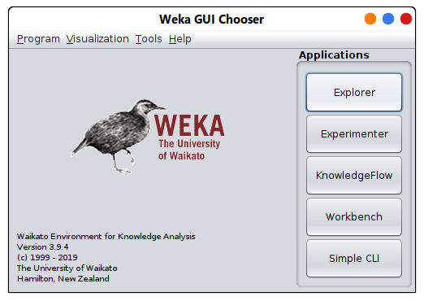

# Introduction sur Weka 

Weka est un atelier d'exploration de données ou un environnement Waikato pour l'analyse des connaissances.

Il contient des algorithmes d'apprentissage automatique pour les tâches d'exploration de données

- 100+ algorithmes de classification
- 75 pour le prétraitement des données
- 25 pour aider à la sélection des fonctionnalités
- 20 pour le clustering, la recherche de règles d'association, etc.

## Site officiel

Pour télécharger Weka et obtenir de la documentation, consultez [cs.waikato.ac.nz/ml/weka/](https://www.cs.waikato.ac.nz/ml/weka/)

## Utilisation

Weka est un outil Java standard pour effectuer à la fois des expériences d'apprentissage 
automatique et pour intégrer des modèles formés dans des applications Java. 
 
Il peut être utilisé pour un apprentissage supervisé et non supervisé. 
 
Il y a trois façons d'utiliser Weka d'abord en utilisant [la ligne de commande](cli.md), 
en second lieu, en utilisant l'interface graphique Weka comme [Explorer](explorer.md),[
Experementer](explorer.md) et [knowledeFlow](explorer.md) ,
et en troisième via son [API avec Java](java.md). 
